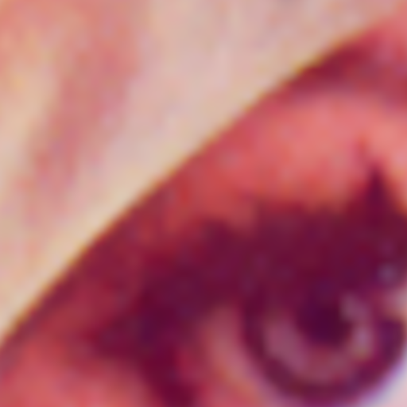
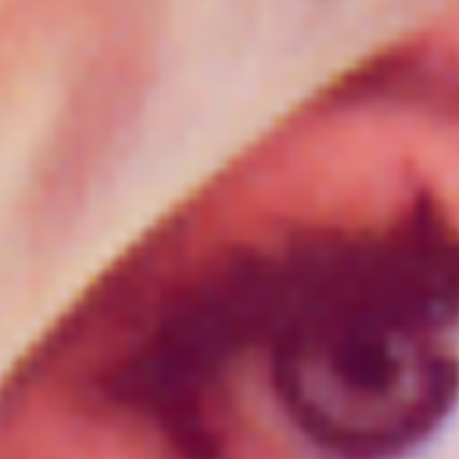

# Scaler biAkima

Demo and compare files for [GIMP](https://www.gimp.org/) plugin [Scaler biAkima](https://github.com/ImageProcessing-ElectronicPublications/gimp-plugin-scaler-biakima):

## Origin

---

---

### Upsampling x4 and cut out the center

#### [GIMP](https://www.gimp.org/) biCubic interpolation

#### [GIMP](https://www.gimp.org/) "no galo" interpolation

#### GIMP plugin [Scaler biAkima](https://github.com/ImageProcessing-ElectronicPublications/gimp-plugin-scaler-biakima)

---

---

#### GIMP plugin [Ogniewski Scaler](https://github.com/pannacotta98/ogniewski-scaler)

#### GIMP plugin [Reverse Interpolate Scale (RIS)](https://github.com/ImageProcessing-ElectronicPublications/gimp-plugin-ris), method HRIS (2 * x2)

---

---

### Upsampling x8 and cut out the center

#### [GIMP](https://www.gimp.org/) biCubic interpolation

#### [GIMP](https://www.gimp.org/) "no galo" interpolation

#### GIMP plugin [Scaler biAkima](https://github.com/ImageProcessing-ElectronicPublications/gimp-plugin-scaler-biakima)

---

---

#### GIMP plugin [Ogniewski Scaler](https://github.com/pannacotta98/ogniewski-scaler)

#### GIMP plugin [Reverse Interpolate Scale (RIS)](https://github.com/ImageProcessing-ElectronicPublications/gimp-plugin-ris), method HRIS (3 * x2)

---

---

### Upsampling x16 and cut out the center

#### [GIMP](https://www.gimp.org/) biCubic interpolation

#### [GIMP](https://www.gimp.org/) "no galo" interpolation

#### GIMP plugin [Scaler biAkima](https://github.com/ImageProcessing-ElectronicPublications/gimp-plugin-scaler-biakima)

---

---

#### GIMP plugin [Ogniewski Scaler](https://github.com/pannacotta98/ogniewski-scaler)

#### GIMP plugin [Reverse Interpolate Scale (RIS)](https://github.com/ImageProcessing-ElectronicPublications/gimp-plugin-ris), method HRIS (4 * x2)

---

---

